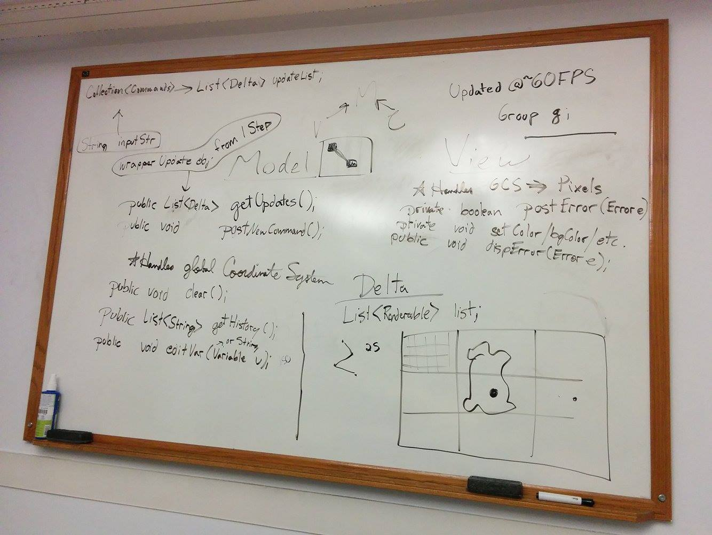

# SLogo Team 19

> Timothy Blumberg, David Maydew, Nick Lockett, Carine Torres, Zdravko Paskalev

Initially we misunderstood how things are drawn on the screen, so we were discussing an architecture that doesn't really make sense.

After, we understood that all that is displayed on the screen is drawn by the turtle, then we started pursuing a design architecture that makes more sense for this purpose.

## Model
Parses user input into controller.commands and generates actions that are to be taken by the turtle which are then passed back to the View to be rendered.

## View / Controller
Handles user input, displaying information to user, and rendering the movement controller.commands from the Model.

# Whiteboard Discussion
This image represents the plan that we came up with during our discussions. Most of the work that we did is not represented internally in this file but in this image and in our team's [Google Doc](https://docs.google.com/document/d/1hNiDFQC-0ftt44jrjWBP3GBfEcsTrl4_g75vU0bSQI4).

